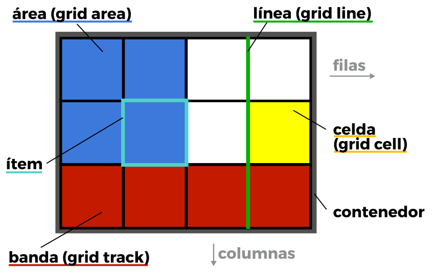
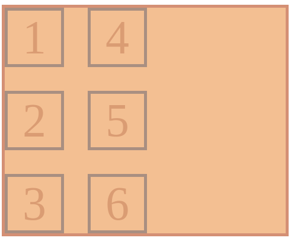
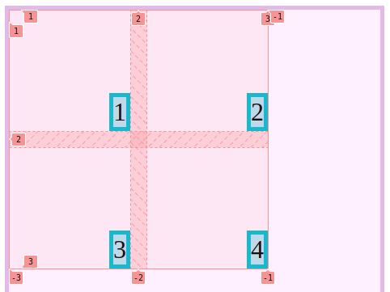
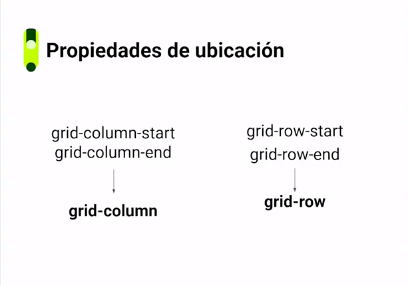
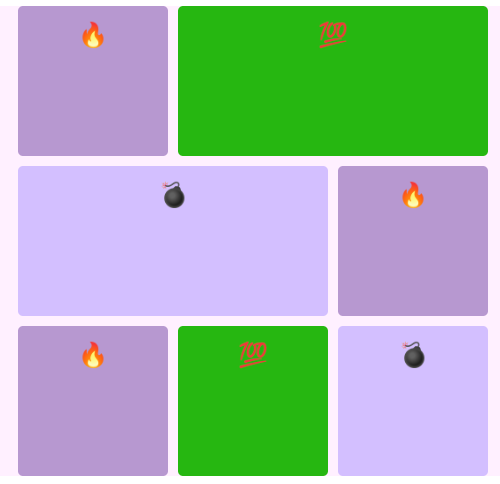

<h1 align="center">
   Display Grid 🐎
   <!-- <a href="http://devchallenges.io" target="_blank">Devchallenges.io</a>. -->
</h1>

## Tabla de contenido
- [Tabla de contenido](#tabla-de-contenido)
- [Display grid](#display-grid)
  - [Que es un contenedor?](#que-es-un-contenedor)
  - [Que es un item?](#que-es-un-item)
  - [Que son las lineas?](#que-son-las-lineas)
  - [Celda](#celda)
  - [Track](#track)
  - [Area](#area)
  - [Propiedades de contenedor](#propiedades-de-contenedor)
  - [Propiedades de alineación](#propiedades-de-alineación)
    - [Alineación del contenedor](#alineación-del-contenedor)
    - [Alineación de los hijos o items](#alineación-de-los-hijos-o-items)
  - [¿Cómo centrar un div en Grid?🔥](#cómo-centrar-un-div-en-grid)
  - [Propiedades de ubicación](#propiedades-de-ubicación)
  
## Display grid


### Que es un contenedor?

Es un elemento que contiene otros elementos dentro

### Que es un item?

Un item son los elementos que están dentro del contenedor

* Ejemplo 
  ```css 
    <div class="Contenedor">
        <div class="item"></div>
        <div class="item"></div>
        <div class="item"></div>
    </div>
  ```
### Que son las lineas?

Las son los elementos que limitan las filas y columnas de una grilla

* rows = filas
* columns = Columnas

### Celda 
Es la unidad minima que tenemos en una Grilla, esta delimitada por 4 lineas. Ocupa 1 columna, 1 Fila

### Track

 Los track son un grupo de celdas que están en una misma fila o una misma columna

### Area

 Pueden usar varias filas o varias columnas al mismo tiempo

### Propiedades de contenedor
* Display grid
* Grid-template 
* Gaps
* Grid-auto

[Código](propiedades-de-contenedor/)

### Propiedades de alineación

* justify-items : nos ayuda a alinear de manera horizontal
* Align-items : Alineación vertical
* Place-items : Es la mezcla entre horizontal y vertical

#### Alineación del contenedor 
* justify-content
* align-content
* Place-content 
  
#### Alineación de los hijos o items
* justify-self
* align-self
* Place-self 

### ¿Cómo centrar un div en Grid?🔥
👀 Ojo con solo dos lineas de código  
```html
<div class="contenedor">
        <div class="item">1</div>
</div>
```
```css 
.contenedor{
    display: grid;
    place-content: center;
}
```

[Código del reto](./propiedades-de-alinacion/)

### Propiedades de ubicación 
Nosotros podemos modificar el espacio que va a ocupar una celda y también el sitio donde se va a ubicar secuencialmente.


* grid-area: le podemos dar nombre a diferentes areas


[Codigo del reto](./Propiedades-de-ubicaion/)